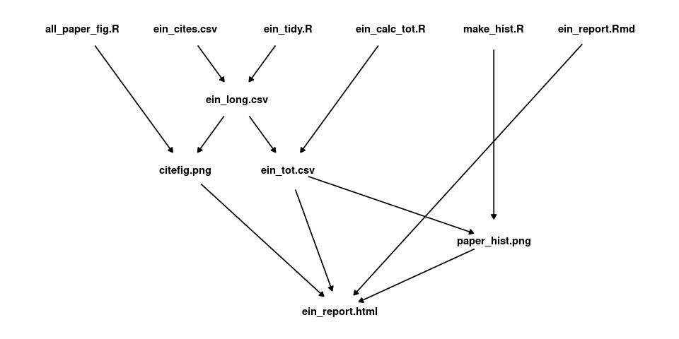

Small Project Examining Einstein Citations
================
David Gerard

<!-- README.md is generated from README.Rmd. Please edit that file -->

This small project just creates some plots of Einstein’s citation
counts, as measured by [Scopus](https://www.scopus.com/home.uri).

The files after everything is evaluated are:

``` r
list.files(recursive = TRUE)
#>  [1] "analysis/all_paper_fig.R"      "analysis/ein_calc_tot.R"      
#>  [3] "analysis/ein_report.html"      "analysis/ein_report.Rmd"      
#>  [5] "analysis/ein_tidy.R"           "analysis/make_hist.R"         
#>  [7] "data/ein_cites.csv"            "Makefile"                     
#>  [9] "Makefile_solutions"            "output/all_paper_fig.Rout"    
#> [11] "output/citefig.png"            "output/ein_calc_tot.Rout"     
#> [13] "output/ein_long.csv"           "output/ein_tidy.Rout"         
#> [15] "output/ein_tot.csv"            "output/make_hist.Rout"        
#> [17] "output/paper_hist.png"         "README-dependency-graph-1.png"
#> [19] "README.md"                     "README.Rmd"
```

These files have the following dependency structure:

<!-- -->

Modify the Makefile to automatically evaluate this pipeline. You can
always check if the Makefile works by deleting everything in the output
folder and rerunning `make` in the terminal. If
“analysis/ein\_report.html” is re-generated, then you are good to go.
